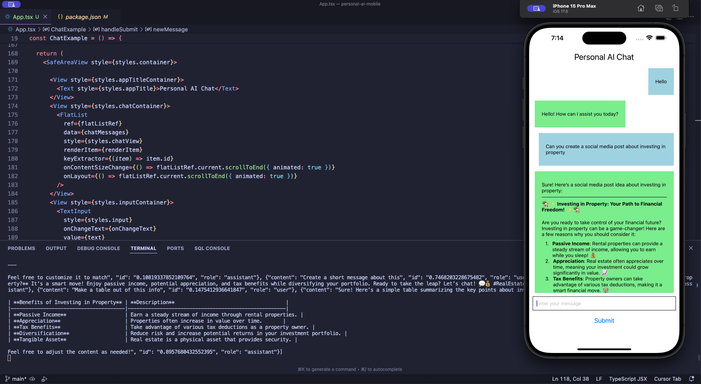

# Expo React Native Chat App using OpenAI (An example)

This repository a mobile application built with Expo and React Native. 



## Prerequisites

Setup Expo in your machine

Follow this guide
https://docs.expo.dev/tutorial/create-your-first-app/

## Environment variables

Create a .env file and add your OPEN AI API key
```
EXPO_PUBLIC_OPENAI_API_KEY="Your OPENAI API key"
```

## Running the example

```bash
npx expo start
```
